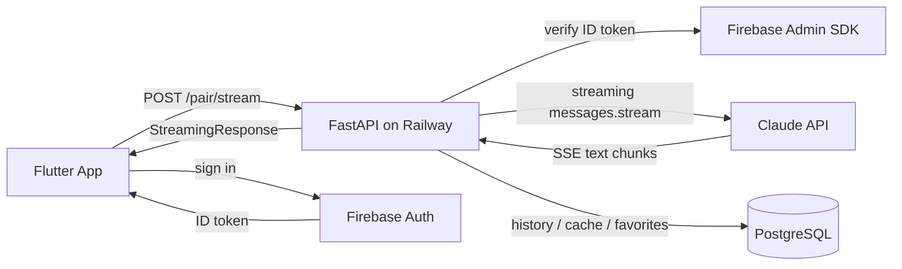

# Duet — AI Sommelier

> Mobile app for iOS and Android. Pairs drinks with any dish using Claude AI. Three answer modes from quick to expert.

[](https://flutter.dev) [](https://anthropic.com) [](https://fastapi.tiangolo.com) [](https://duetaiapp.com)

**Live:** [duetaiapp.com](https://duetaiapp.com)

## What it does

User describes a dish, picks an answer mode (Quick / Detailed / Expert), and gets a personalized drink pairing recommendation streamed in real time from Claude. Recommendations are personalized by region (CIS markets) and user preferences stored in profile. Subscription-based with a free tier (10 requests).

Two pairing directions:
- **Food → Drink** (default) — describe a dish, get top drink pairings across categories (wine, spirits, beer, cocktails)
- **Drink → Food** — pick a drink, get food pairing suggestions

## Repository structure

```
/
├── lib/                        # Flutter app (Dart)
│   ├── main.dart               # App entrypoint, Firebase init, routing
│   ├── screens/                # UI screens
│   │   ├── home_screen.dart    # Main input + mode selector
│   │   ├── result_screen.dart  # Streaming pairing result
│   │   ├── history_screen.dart # Past pairings (30-day retention)
│   │   ├── favorites_screen.dart
│   │   ├── profile_screen.dart # Preferences, region, subscription
│   │   ├── paywall_screen.dart # RevenueCat subscription flow
│   │   ├── auth_screen.dart    # Google / anonymous sign-in
│   │   └── onboarding_screen.dart
│   ├── services/
│   │   ├── api_service.dart    # Streaming HTTP client for /pair/stream
│   │   ├── auth_service.dart   # Firebase Auth (Google + anonymous)
│   │   └── storage_service.dart
│   ├── models/                 # Data models (PairingResult, etc.)
│   └── widgets/                # Reusable UI components
├── backend/                    # FastAPI backend (Python)
│   ├── main.py                 # All routes + Claude streaming logic
│   ├── requirements.txt
│   ├── schema.sql              # PostgreSQL schema
│   └── .env.example
├── assets/                     # Images, icons, fonts
├── android/                    # Android-specific config
├── ios/                        # iOS-specific config
└── docs/                       # Marketing docs
```

## Architecture



Flutter consumes the stream via `Stream<String>` in `api_service.dart` and renders tokens as they arrive — no full-page reload.

**PostgreSQL cache:** identical requests (same dish + mode + prefs) are served from a 30-day cache, skipping the Claude API call entirely. Cache key includes a `PROMPT_VERSION` integer that auto-invalidates on prompt changes.

## Tech stack

| Layer | Tech |
|---|---|
| Mobile | Flutter 3.x, Dart |
| Backend | Python 3.11, FastAPI, deployed on Railway |
| AI | Claude API (Anthropic) — streaming via `AsyncAnthropic.messages.stream` |
| Auth | Firebase Authentication (Google Sign-In + anonymous) |
| Monetization | RevenueCat subscription paywall |
| Database | PostgreSQL (Railway) — history, favorites, cache |
| iOS builds | Codemagic (cloud build from Windows dev machine) |

## Key features

- **Streaming responses** — Claude tokens stream to the UI in real time via `StreamingResponse` (FastAPI) → `Stream<String>` (Flutter)
- **Three detail levels** — `simple` / `standard` / `expert`; expert is Premium-only (enforced server-side)
- **PostgreSQL response cache** — 30-day TTL, probabilistic cleanup (5% chance per insert), auto-invalidates on prompt version bump
- **Region-aware prompts** — recommendations adapt to CIS markets (Russia, Kazakhstan, Ukraine, Belarus)
- **User preferences** — profile preferences bias category priority in results
- **Dual pairing direction** — food→drink and drink→food
- **Firebase Auth** — Google Sign-In and anonymous mode; token verified server-side via Firebase Admin SDK
- **History + favorites** — persisted in PostgreSQL per user, history auto-deleted after 30 days

## Code highlights

| What | Where |
|---|---|
| Streaming endpoint | `backend/main.py` → `POST /pair/stream` (line ~819) |
| Prompt builder | `backend/main.py` → `_build_prompt()` (line ~608) |
| PostgreSQL cache | `backend/main.py` → `_cache_get()` / `_cache_set()` (line ~42) |
| Flutter stream consumer | `lib/services/api_service.dart` → `pairStream()` (line ~60) |
| Auth service | `lib/services/auth_service.dart` |
| Home screen | `lib/screens/home_screen.dart` |
| Result screen | `lib/screens/result_screen.dart` |

## Local setup

### Backend
```bash
cd backend
python -m venv .venv
source .venv/bin/activate   # Windows: .venv\Scripts\activate
pip install -r requirements.txt
cp .env.example .env        # fill in ANTHROPIC_API_KEY, DATABASE_URL, FIREBASE_SERVICE_ACCOUNT_JSON
uvicorn main:app --reload
```

### Mobile app
```bash
flutter pub get
flutter run
```

Firebase config (`lib/firebase_options.dart` and `android/app/google-services.json`) is excluded from version control — generate via `flutterfire configure`.

## Design tokens

| Role | Hex |
|---|---|
| Background | `#0D0D0D` |
| Cards | `#1A1A1A` |
| Accent gold (large) | `#C9A84C` |
| Gold (small text, AA contrast) | `#D4B563` |
| Text primary | `#FFFFFF` |
| Text secondary | `rgba(255,255,255,0.4)` |

## About

Built and maintained by Boris Komarov. Part of a portfolio of production AI products: [Velabot](https://velabot.io).

## Contact

- Studio: [vibecraft.kz](https://vibecraft.kz)
- Email: bkomarov85@gmail.com
- Telegram: [@borisk85](https://t.me/borisk85)

---

*Closed contributions. Production app showcased as portfolio.*
